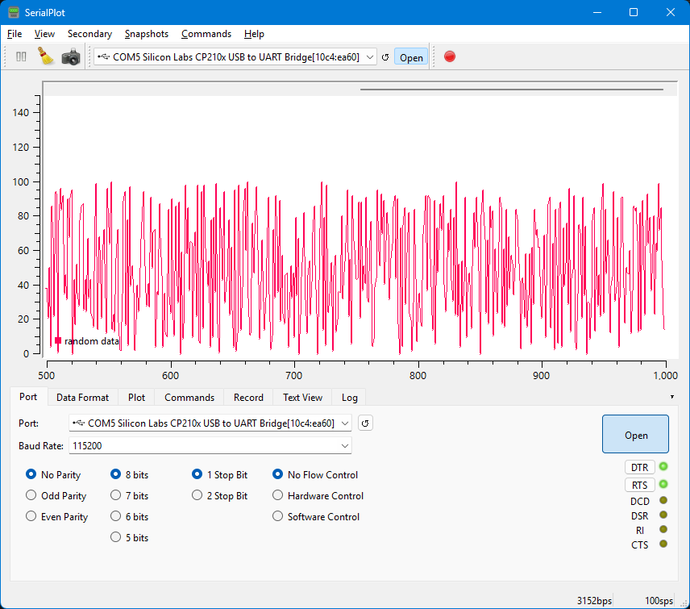

# Random UART Stream

## Project Overview

Random UART Stream is a minimal firmware for ESP32 development boards built with PlatformIO and the Arduino framework. It provides a synthetic and controllable numeric data source over the USB serial/UART interface.

The firmware is intended for testing host-side software components that consume serial data, such as acquisition routines, parsers, data loggers, plotting tools, dashboards, and data-processing pipelines.

## Purpose

The project generates a continuous stream of random integer values only after receiving a start command through the serial port. The stream can be stopped with a second command byte.

This makes the firmware useful as a lightweight test source when developing or validating software that depends on serial input, without requiring external sensors or measurement hardware.

## Scientific Use

This firmware was designed to provide a simple synthetic UART/USB serial data source for testing host-side acquisition software. It can be used to validate serial communication, parsing routines, logging pipelines, plotting tools, dashboards, and basic data-flow integration.

The generated values are random integers and must not be interpreted as physiological, biomedical, EEG, or sensor-derived signals. The firmware does not simulate the spectral, temporal, statistical, or artifact characteristics of real EEG signals.

In scientific contexts, Random UART Stream should be used only to validate serial communication, data formatting, acquisition flow, software integration, and reproducibility of host-side data handling. It must not be used to validate neurophysiological analysis methods or conclusions.

Example article wording:

> For validation of the host-side serial acquisition pipeline, a synthetic UART data source was implemented using an ESP32 development board. The firmware, named Random UART Stream, transmits random integer samples through the USB serial interface at 115200 baud, with start and stop commands controlling the stream. The generated data were used only to validate serial communication, parsing, logging, and integration of the Python acquisition software, and were not intended to represent real EEG signals.

## Hardware Requirements

- ESP32 development board compatible with the PlatformIO `esp32dev` target
- USB cable for programming and serial communication
- Host computer with PlatformIO installed

## Firmware Behavior

At startup, the firmware initializes the USB serial interface at `115200` baud, configures the built-in LED on GPIO `2`, and seeds the random number generator.

The stream is inactive after reset. When the firmware receives the start command, it sends one random integer sample every `10 ms`. Each value is in the range `0` to `100`, inclusive.

The built-in LED blinks every `100 ms` while streaming is active. When the stop command is received, streaming stops and the LED is turned off.

## Serial Protocol

| Parameter | Value |
| --- | --- |
| Baud rate | `115200` |
| Data format | ASCII decimal integer |
| Value range | `0` to `100` |
| Line ending | `\r\n` |
| Sample interval | `10 ms` |
| Start command | `s` |
| Stop command | `f` |

Command bytes:

| Command byte | ASCII character | Action |
| --- | --- | --- |
| `0x73` | `s` | Start the random numeric stream |
| `0x66` | `f` | Stop the stream |

Any other received byte is ignored.

## Build and Upload

The PlatformIO environment is defined in `platformio.ini`:

```ini
[env:esp32dev]
platform = espressif32@^6.9.0
board = esp32dev
framework = arduino
monitor_speed = 115200
```

Build the firmware:

```sh
pio run
```

Upload it to the ESP32:

```sh
pio run --target upload
```

If PlatformIO does not detect the serial port automatically, specify it explicitly:

```sh
pio run --target upload --upload-port COM3
```

Open the serial monitor:

```sh
pio device monitor
```

Send `s` to start streaming and `f` to stop streaming.

## Example Output

After sending the start command, the serial output has one integer per line:

```text
42
7
100
18
63
```

On the wire, each sample is terminated with `\r\n`.

The figure below shows an example visualization of the random integer stream received from the serial interface:



## Limitations

- The generated samples are random integers only.
- The data do not represent EEG, physiological, biomedical, or sensor-derived signals.
- The firmware does not model EEG frequency bands, waveform morphology, artifacts, noise color, temporal dynamics, electrode behavior, or statistical properties of real recordings.
- The firmware validates host-side serial communication and data-flow integration only.
- The stream starts only after the host sends the `s` command.
- The default firmware targets the ESP32 `esp32dev` board profile.

## How to Cite

Recommended citation:

T. P. Silva, "Random UART Stream," Version 1.0.0, GitHub repository, 2026. [Online]. Available: https://github.com/import-tiago/random-uart-stream

## License

This project is licensed under the MIT License. See [LICENSE](LICENSE) for details.
